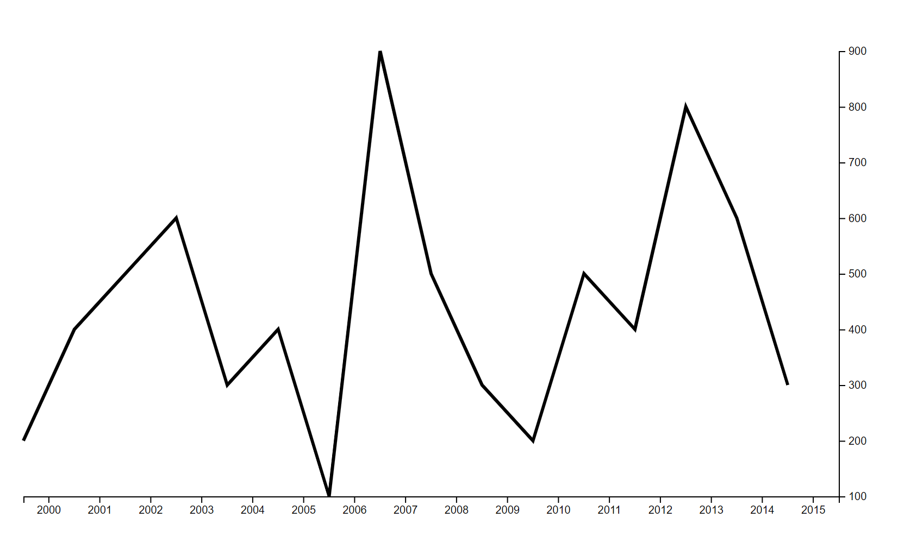

### Day 1

Today I focused on creating a simple, static line graph using Vue and d3. Surprisingly, I needed practice on even this simple task. I spent a lot of my time transforming my "test data" into the proper format so that I could generate the path element with the proper d attribute, and a lot of time tinkering with the scales. This was the end result of a simple line graph. 

Per my past experience, I used Vue's computed properties to a do a lot of the work for me in transformation and generation of appropriate visual elements. I took the custom directive called "axis" from a tutorial used my masters program, which I ended up only half-understanding. 

What did I learn? Through incorporating the axis directive, I learned that it is possible to use d3's selections in conjunction with Vue's virtual DOM, something that I previously did not think was possible, and makes me excited to try to understand the custom Vue directives to see if I can replicate it for manny other d3 functionalities I did not have time to implement in my thesis. 