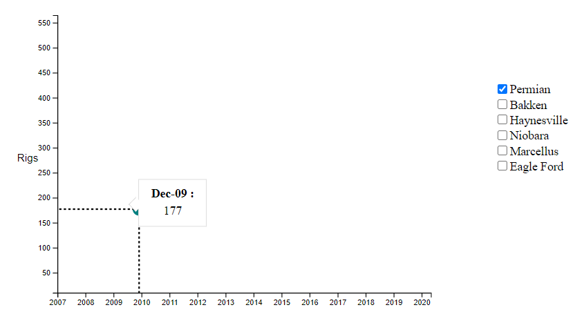

# Day 10

Visualization Type: Line Graph <br>
Data Source: Energy Information Agency (eia.gov) <br>
Subject: Regional Rig Counts for oil and gas drilling <br>
Libraries Used: d3.js <br>
Goal: Create checkboxes, and bind event listeners<br>



I realized how limited jQuery is today. D3 can do DOM manipulation much faster. 

As you can see, I ran into some issues. For one thing, my path attribute disappeared for unknown reasons. What I did was try to have the line generator within the actual appending to the DOM, to save code and also because I anticipated an issue when checkbox data was collected, I would have to dynamically create all the line generators and pass them in. 

Originally, I thought I could use jQuery to capture the checkbox data and send it into drawChart() but I found this was not the right way to think about the interactivity as I thought more about it. The main problem is that using this method would involve redrawing the entire chart every time the checkboxes were changed and submitted. I thought of a way to just write a separate "updateChart" function that would be in charge of changing the visuals every time it was called... but this introduced a problem with scope. How will updateChart() know about variables declared and established in drawChart()? 

The final blow to jQuery's reputation in my mind came when I realized I could do all the functionality that I wrote in jQuery in about 15 lines, in d3 in about 2 lines. No more d3 for this cowboy, no sirree. 

```javascript
$('#permian').prop('checked', true);

let checkboxes = d3.selectAll('.controls')
        .on('change', getData);

function getData() {
        console.log(this);
    }

```

So now that I have all changes to checkboxes being loaded into a new function, it's now time to redo the architecture of the drawChart() function and bring in .enter(), .join(), .update(), .exit().remove() and all that good stuff. I am not very confident on those concepts, although I have used them for several charts I made back in February. 


 

