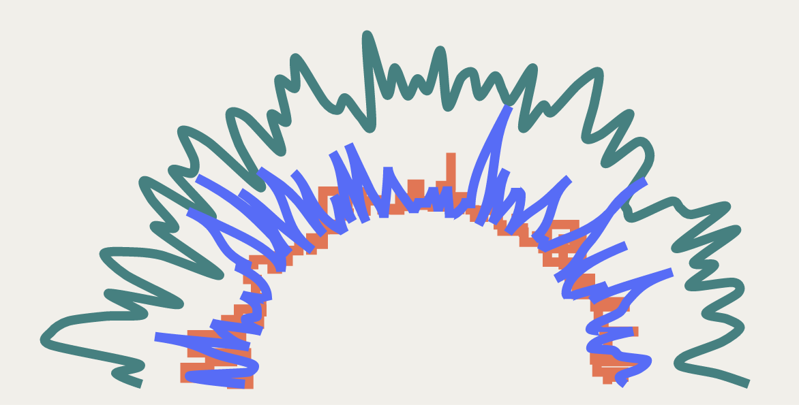

# Day 14

Visualization Type: Line Graph  
Data Source: Randomly Generated  
Subject: My portfolio website  
Libraries Used: d3.js  
Goal: Get the transition working correctly and curve the lines  

I curved the lines here. Nothing special. I mostly just want it to look good!