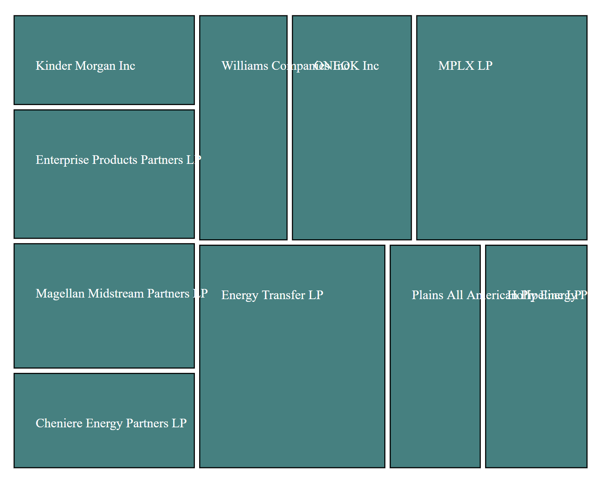
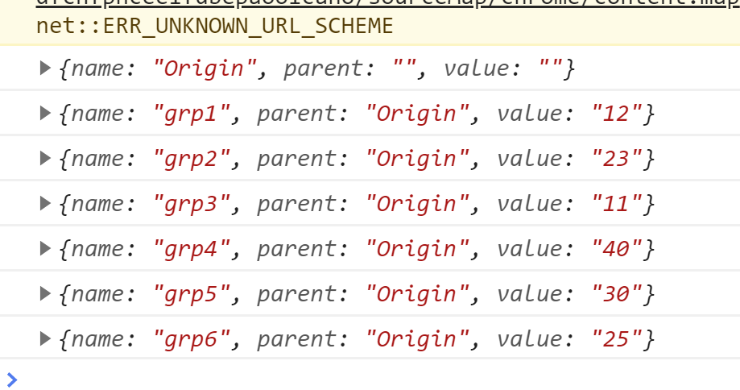

# Day 16

Visualization Type: Treemap  
Data Source: Googling  
Subject: Dividend yields for midstream energy companies  
Libraries Used: d3.js, jQuery  
Goal: Create a simple treemap 

Treemaps are one of my favorite visualizations, but this is the first day I've made one in d3. This treemap shows the top publicly traded midstream companies organized by their dividend yield. 

There is a lot that happens behind the scenes on this one, and it amazes me that the d3 algorithms used basically do almost all the work for you. It does involve learning a bit about hierarchical data structures, which are entirely new to me. 

The main difference here appears to be that you don't need scales, or axes. What we are doing is "stratifying" the data, which appears to work best in a certain format, which is, as I understand the term, a linked list. 

Each piece of data needs a label that links it to a larger category. That larger category is the parentId of d3.stratify() and each individual node or piece of data has to have its own sub-label, which is called by .id() within d3.stratify(). This produces a "root" data structure. 

Afterwards, sum needs to be called on this root data structure, to pass in the values of each of the sub-labels, which determines the sizes and shapes of the rectangles. 

Then the d3.treemap() function takes a size array, kind of like a range, and then after that it is simply the standard .selectAll().data().enter().append() process for both the rects and the text. 

So what did I not understand? 

I definitely was scratching my head as to why (dataset) and (root) had to be bound to the d3.stratify() method chain and d3.treemap method chain, respectively. I need to look into this. 

But overall, a success!