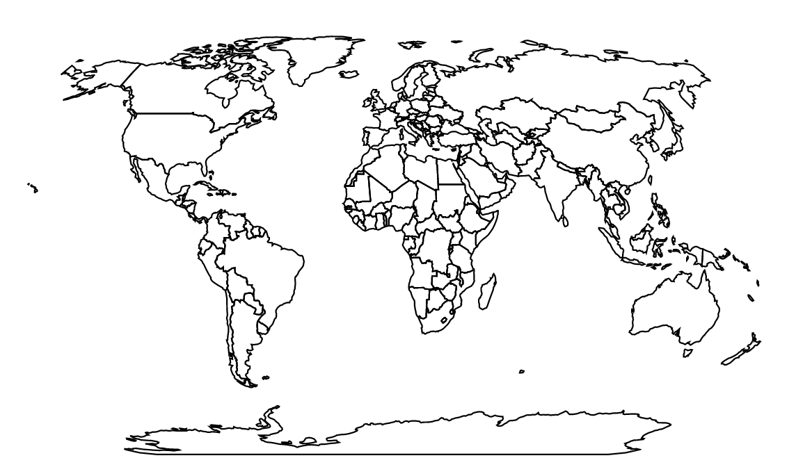

# Day 17

Visualization Type: Geographic  
Data Source: Publicly available GeoJSON  
Subject: The World!  
Libraries Used: d3.js, jQuery  
Goal: Get the world drawn in the browser!  

Geographical viz is something I never did much with while I was in school, apart from using Leaflet for a few school projects. This is the first time playing around with it in D3, so I decided to do something really, really simple - draw the world. I acquired a geojson with the country data I needed, in the proper format. 

I'm starting to get really used to the basic code to format and center all visualizations I make. 

The projection part was new. When I originally tried to use this to create the projection, the console threw an error. I checked the docs and found that new utility libraries had to be piped into the html in order for many of the geo functions to be used. I need to check to make sure there is a stable way to access these functions, since I want to be able to use them even when there isn't internet access. 

The second part was actually appending the paths, which I still find confusing. The .features part of the geoJSON actually contains the coordinates, but it also kinda doesn't - the actual coordinates are contained within .geometry, then .coordinates, which contains the "array of arrays" with all the coordinate points. So somehow d3.geoPath().projection(projection) knows to go that number of layers deep - and we didn't even have to create a return function to pass it specific patterns.

While it's satisfying to get this done so easily, this is really one of my biggest issues with d3 - there is so much going on below the hood, which can be a good thing, but it can also be very confusing to learn the actual processes. 

In any case, this is a good starting point. 