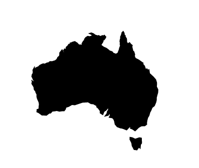

# Day 18

Visualization Type: Geographic  
Data Source: Publicly available GeoJSON  
Subject: Australia  
Libraries Used: d3.js, jQuery  
Goal: Filter by a specific country  

Today was fairly easy. I changed the projection from geoNatural to geoMercator to get the easily identifiable paths for each country. 

I did the centering part manually to get Australia in the center of the SVG... but I think there has to be a better way to do this. 

Additionally, doing a filter for a specific country is absurdly simple using .filter() - I wonder if there is a way I can map this function more effectively to have it compare d.properties.name against an array of names? Might save this for tomorrow. 