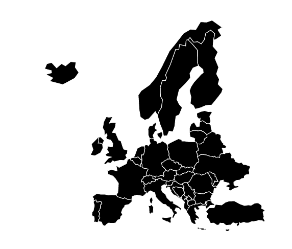

# Day 19

Visualization Type: Geographic  
Data Source: Publicly available GeoJSON  
Subject: Europe  
Libraries Used: d3.js, jQuery  
Goal: Filter by group of countries  

Somewhat simple as well - it was all about the filter function. The geoJSON in properties has no other identifying information in it apart from names, which oftne don't correspond with the common names for many of the countries. So I just created a separate array of European country names to loop through, then for each country in dataset.features, checked them against the list. 

However, the problem with this is that the political boundaries sometimes include territories, like for France, that are very far afield (a legacy of the European colonial system), which you may not need to display if all you want is a map of Europe. 

So the best way to filter a map of a region might be by coordinates, rather than by long lists of names. I will look into this in the future. 