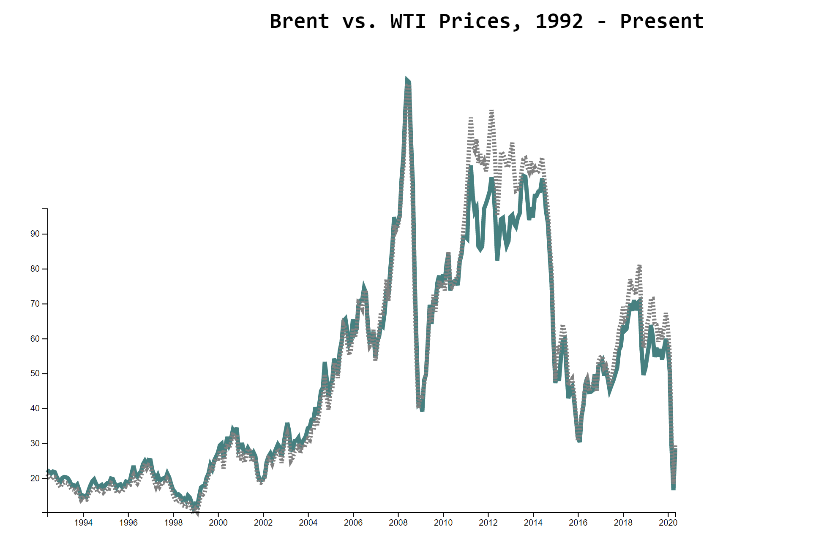

# Day 2

Visualization Type: Line Graph  
Data Source: Energy Information Agency  
Subject: Oil Prices  
Library Used: d3.js  

Today was pretty easy for me, but I did learn a few very valuable things. The first was how easy it was to selectively return data from a csv using d3.csv's callback function. It made the data wrangling part of today's work almost trivial. 

However, a few factors were introduced that I don't know how to resolve just yet. 

<ul>
    <li>With multiple data series, how can I make sure my scaling functions are scaling to the minimums and maximums of all the values in the dataset? For this one, I have propane, WTI oil, and Brent oil - which makes it difficult to scale and even though WTI and Brent are measured in the same units, the path exceeded the yAxis. Will have to look into this.</li>
    <li>I need to start making legends or annotations... perhaps experimenting with both?</li>
    <li>I also hope to include the area between both lines as something separate that can be styled at will. I've seen this before and would like to figure out how to do it, since I think this is an optimal way to represent "spread".</li>
    <li>I need to figure out the context in order to use the rest of the curves within d3. I found the guidance in the docs to be not very helpful and there were not many examples to choose from. </li>
</ul>

