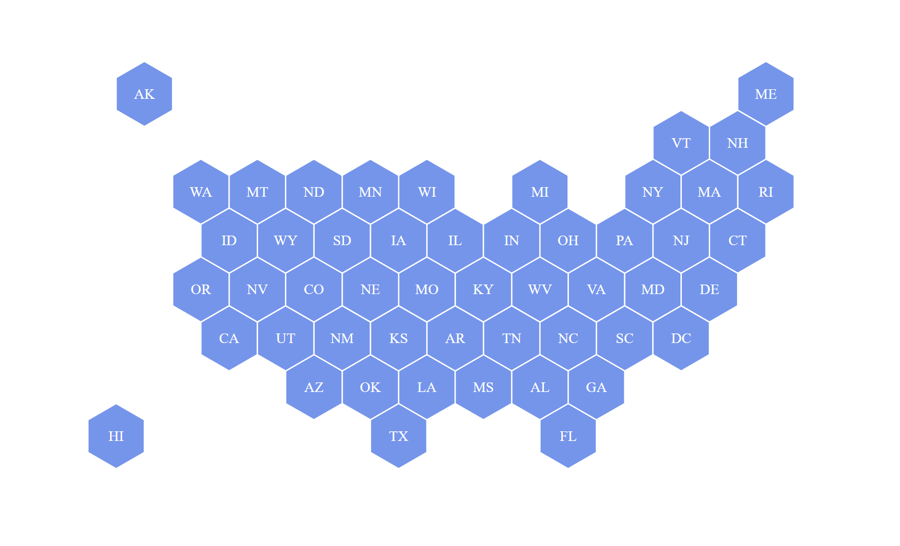

# Day 20

Visualization Type: Geographic  
Data Source: Andrew Hill of Carto  
Subject: USA  
Libraries Used: d3.js, Carto  
Goal: Create a hexbin map  

Hexbins require special coordinates and transformation from regular coordinate points in order to be used as hexbins. As such, there is no publicly available hexbin map of everything, but via d3-graph-gallery, I used this one from Andrew Hill at Carto, who was making a choropleth out of bee population data for each state. 

The data can be found <a href="https://team.carto.com/u/andrew/tables/andrew.us_states_hexgrid/public/map">here</a>.

Apart from obtaining the hexbin data, nothing else was too complicated here. 

One new aspect was my introduction to d3.centroid() which finds the absolute center point of a shape drawn by data, which is very useful for positioning. However, I think it only works with a closed shape, but it may be useful for other geographical visualizations I do in the future. 

Another difficulty I anticipate in the future is dynamically updating the scale and translation in the projection part of the code. 