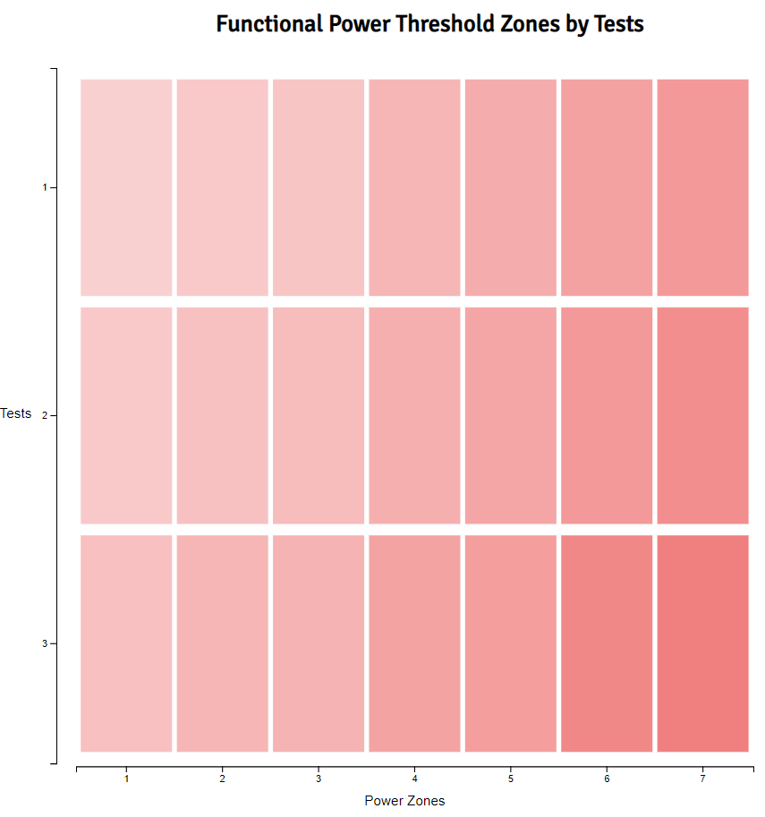

# Day 21

Visualization Type: Heat Map  
Data Source: My own Peloton data  
Subject: Cycling efficiency  
Libraries Used: d3.js  
Goal: Create a basic heatmap  

Back from vacation. Tried a heatmap today and it worked beautifully! I can see why designers use this so much, since it is very appealling to the eye. From an information design perspective, it is lacking a little bit but can be improved in my opinion. The problem from an information design perspective is that it tells you ranking but degree of differentiation is difficult to determine - it is, on the other hand, easier to differentiate ranking than by looking at a table. It also needs some way of highlighting outliers. 

The data I used is my own cycling data from Peloton, which shows the improvement in my FTP power zones over time. Obviously this isn't of interest to everyone and won't make much sense if you're not into cycling like I am, but the use of this data for the heatmap is so perfect that I couldn't pass it up. 

For this data, the x and y scales are both categorical, which means we have to use "scaleBand" in the d3 arsenal. There isn't much of a difference with scaleLinear, except that you can't use d3.extent() to evaluate the range of values you pass in, because each one is its own category. I made this mistake briefly but quickly realized how silly it was. You can also set padding within the scale to space out the elements, which looks a bit better in my opinion. 

Lastly, it was just a matter of binding the data and drawing the elements. However, getting the width and height of each rect correct was difficult and only became clear once I looked through the docs and saw .bandwidth() as a method of the d3.scaleBand() function, then it  became extremely simple. 

I may continue on with this and see if I can get more cycling data, maybe for a benchmark or other user. If I do add a different user, I'd like to do a different color scale - is this feasible? Additionally, I want to add a tooltip, for obvious reasons. Also, I'd like to highlight outliers, and maybe use the same data to create a correlogram. 

