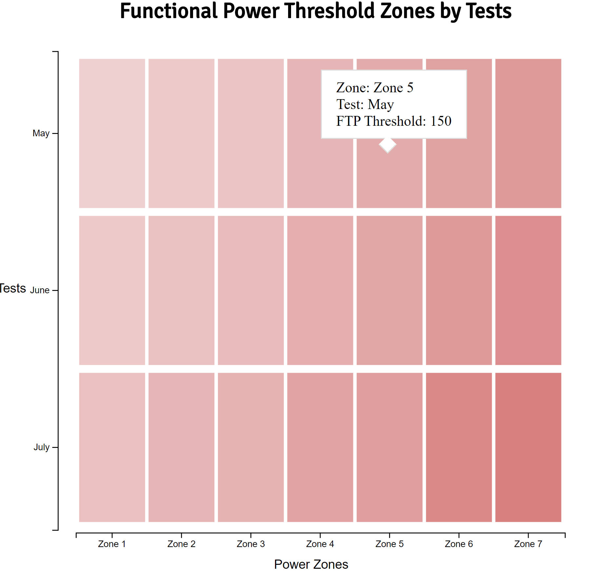

# Day 22

Visualization Type: Heat Map <br>
Data Source: My own Peloton data <br>
Subject: Cycling efficiency <br>
Libraries Used: d3.js <br>
Goal: Add a tooltip to the heatmap <br>




Decided to continue with the heatmap I made yesterday and add a tooltip, which somewhat alleviates the information design issues of not being able to discern the actual degree of differentiation between the color values. I think it would make sense to keep expanding this out as I get my hands on more data, perhaps differentiating cyclists rather than tests, which would make more sense, ultimately, for a comprative visualization. As it stands, I've done too few FTP tests on my bike to merit making an entire heatmap, although I think the bigger rectangles do look nice. 

The actual creation of the tooltip was very similar to the one I made for the line chart two weeks ago. However, you cannot invert the scales with a d3.scaleBand() function, which is what I tried first. Eventually, I decided to look up how exactly to place the tooltip itself. I had no idea you could just style elements left and top - it makes sense obviously, but it did not occur to me. 

The other confusing part came with populating the tooltip with values from each of the rects. Because invert() didn't work with scaleBand(), I tried to think about how d3 would know about what values were being bound to which rect. 

The answer was surprisingly simple and something I had overlooked. If you consolidate the data binding and drawing process by doing the now-familiar d3.selectAll('rect').data(myDataSet), <b> any function you bind to the elements created during this process will have access to the data element that created it. </b> 

I think this is why many d3 scripts are so hard to read. It makes sense to consolidate the data bind and drawing all associated elements and binding event listeners, all in the same block of code. For a beginner, this looks like a complete mess and is difficult to understand. But once you get it, it starts to click. 

```javascript
    function moveRect(d) {
        tooltip.select('#zone')
            .text("Zone: " + d.zone);
        
        tooltip.select('#test')
            .text('Test: ' + d.tests);
        
        tooltip.select('#ftp')
            .text('FTP Threshold: ' + d.ftp)

        tooltip
            .style('left', (d3.mouse(this)[0] + 40) + "px")
            .style('top', (d3.mouse(this)[1]-20) + "px")
    }
```

