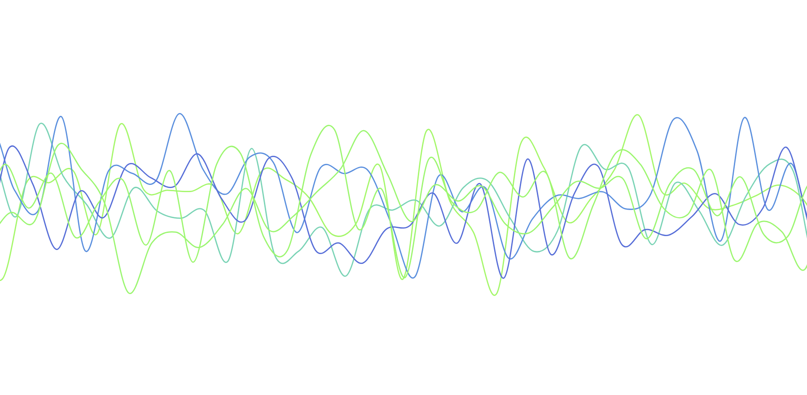

# Day 23

Visualization Type: Line Graph  
Data Source: Randomly Generated  
Subject: Random Distribution Patterns  
Libraries Used: d3.js  
Goal: Refactor my opening visualization for my portfolio website  
Forked from: <a href="https://github.com/neil-oliver/playgrounds">Neil Oliver's "playgrounds" repository</a>

I finally found an example to work off of that I can use to refactor the way that my original "random line" viz was doing its transition to new data points. Turns out I had not attached the clip-path to the correct attribute in the correct place. I'm still working it, but this is what I have so far. 
