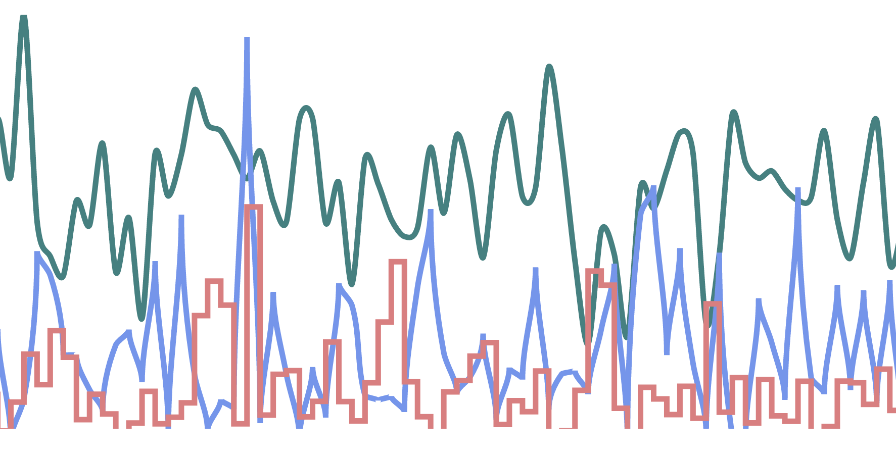

# Day 24

Visualization Type: Line Graph <br>
Data Source: Randomly Generated <br>
Subject: Random Distribution Patterns <br>
Libraries Used: d3.js <br>
Goal: Refactor my opening visualization for my portfolio website <br>
Forked from: <a href="https://github.com/neil-oliver/playgrounds">Neil Oliver's "playgrounds" repository</a>



I did it!!!

Going to do my best to explain how it works here. 

There were a few problems with my old version. Asynchronicity was one problem. I had to make sure that all drawing of the data was done before the first "tick" function was called on a transition, and I wasn't sure this was happening 100% of the time. The other problem was that I wasn't calling the clip-path attribute with my clipPath that I created. And lastly and most critically, I called the line generators for the d attribute for the paths with their associated data BEFORE the tick function is called. In Neil's code, the d attribute and its line function is only called within the tick function. 

So the path is appended, and the data is joined along with its supporting attributes outside of the "tick" function. 

But within the tick function is when the d-attribute is actually created using the line generators. See below:

This is the good example: 

```javascript
function draw(i,speed,color){

        bounds.append("g")
            .attr("clip-path", "url(#clip)")
            .append("path")
            .datum(data[i])
            .attr("class", "line")
            .attr("stroke",color[i])
            .attr('stroke-width', 4)
            .transition()
            .duration(speed)
            .ease(d3.easeLinear)
            .on("start", tick);

function tick() {
    
        // Push a new data point onto the back.
        data[i].push(randoms[i]());
        // Redraw the line.
        d3.select(this)
            .attr("d", functions[i])
            .attr("transform", null);
        // Slide it to the left.
        d3.active(this)
            .attr("transform", "translate(" + xScale(-1) + ",0)")
            .transition()
            .on("start", tick);
        // Pop the old data point off the front.
        data[i].shift();
    }
}
```


Bad example:

```javascript
    center.append('path')
        .datum(normalData)
        .attr('id', 'normal')
        .attr('class', 'path')
        .attr('d', normal);
    
    center.append('path')
        .datum(logData)
        .attr('id', 'log')
        .attr('class', 'path')
        .attr('d', log);

    center.append('path')
        .datum(exponentialData)
        .attr('id', 'exp')
        .attr('class', 'path')
        .attr('d', exp);

    
const transition = d3.transition().duration(500).ease(d3.easeLinear);

d3.selectAll('.path').transition(transition)
        .on('start', tick);

function tick() {

    normalData.push(randomNormal());
    exponentialData.push(randomExponential());
    logData.push(randomLog());

    normalData.shift();
    exponentialData.shift();
    logData.shift();
    
    d3.select('#exp').transition(transition)
        .attr('d', exp)
        .attr('transform', `translate(${xScale(-1)}, 0)`)
        
    d3.select('#log').transition(transition)
        .attr('d', log)
        .attr('transform', `translate(${xScale(-1)}, 0)`)

    d3.select('#normal').transition(transition)
        .attr('d', normal)
        .attr('transform', `translate(${xScale(-1)}, 0)`)
        

    d3.active(this)
            .transition(transition).on('start', tick);
}
```