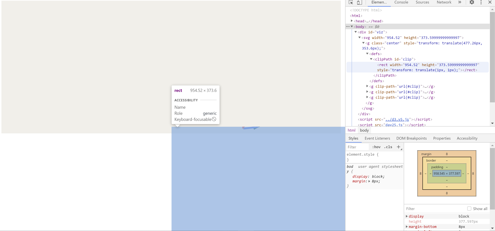

# Day 25

Visualization Type: Line Graph  
Data Source: Randomly Generated  
Subject: Random Distribution Patterns  
Libraries Used: d3.js  
Goal: Refactor my opening visualization for my portfolio website  
Forked from: <a href="https://github.com/neil-oliver/playgrounds">Neil Oliver's "playgrounds" repository - check out animated waves</a>

The basic version of this worked fine by looping through and recursively calling the tick function within the draw function. 

Now, the problem is that, while the graph moves to the left, if I include the clip-path attribute to each line in the draw function (line 108) this causes the clipPath to shift downwards, only revealing a tiny amount of the visualization. I double and triple-checked - this error does not extend into the basic functionality - if you inspect the d attributes of each path as they are updating, they are changing and there are no errors in the console. So after narrowing it down, I believe it's a problem only with the clipPath attribute and the way it is translating from "defs" to each path. 

You can see this error pretty clearly in the below image. The only difference with this error code is that I uncommented line 108 to include the attribute of clip-path, attaching the rectangle defined on lines 95-100.

My only ideas currently is that it is some kind of problem with appending the paths from the constant "center" that I defined. Could it be possible to transform-translate each clip-path back up to the correct boundaries? Without the clipPath operating correctly, even with the data updates working correctly, the transition still looks very jarring.