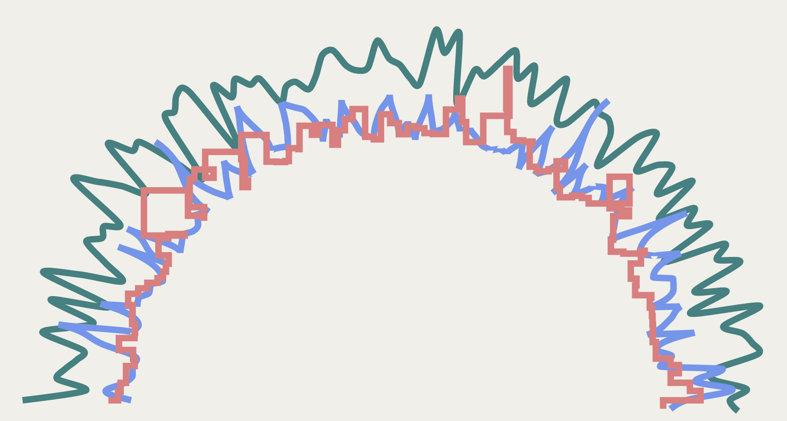

# Day 28

Visualization Type: Line Graph <br>
Data Source: Randomly Generated <br>
Subject: Random Distribution Patterns <br>
Libraries Used: d3.js <br>
Goal: Refactor my opening visualization for my portfolio website <br>
Forked from: <a href="https://github.com/neil-oliver/playgrounds">Neil Oliver's "playgrounds" repository</a><br>
Idea from: <a href="https://bost.ocks.org/mike/path/"> Mike Bostock's Path Transition Gists </a>



Look at this visualization:

https://mi-desai.github.io/vizfordays/day_24/day24.html

Notice the very smoothed out transition. 

Now this one:

https://mi-desai.github.io/vizfordays/day_28/day28.html

Notice the jankiness of the transition. 


The issue is that I'm using more or less the same code to produce these visualizations, obviously with adjustments to curve the lines, etc. But the same process applies:

1. clipPath rectangle is defined with its dimensions and is stored in "defs".
2. The clip-path SVG attribute is attached to each new "g" tag that gets created so that it gets clipped when any point on the visualization enters or exits the dimensions defined in the clipPath. 
3. This is supposed to result in a smooth rendering of new data points but the two don't look anything alike. 


Here is the code for the smooth transition that I used in day24:

```javascript
bounds.append("defs").append("clipPath")
        .attr("id", "clip")
        .append("rect")
        .attr("width", dimensions.boundedWidth)
        .attr("height", dimensions.boundedHeight);

function draw(i,speed,color){

        bounds.append("g")
            .attr("clip-path", "url(#clip)")
            .append("path")
            .datum(data[i])
            .attr("class", "line")
            .attr("stroke",color[i])
            .attr('stroke-width', 4)
            .transition()
            .duration(speed)
            .ease(d3.easeLinear)
            .on("start", tick);

function tick() {
    
        // Push a new data point onto the back.
        data[i].push(randoms[i]());
        // Redraw the line.
        d3.select(this)
            .attr("d", functions[i])
            .attr("transform", null);
        // Slide it to the left.
        d3.active(this)
            .attr("transform", "translate(" + xScale(-1) + ",0)")
            .transition()
            .on("start", tick);
        // Pop the old data point off the front.
        data[i].shift();
    }
}

```


Here is the code for the janky transition of day 28: 

```javascript
// everything should originate from a center point, so instead of moving the amount of the left and top margins down, this g tag is created by going to the center
const center = viz.append('g')
    .attr('class', 'center')
    .style('transform', `translate(${dimensions.boundedWidth / 2}px, ${dimensions.boundedHeight - dimensions.margins.bottom - dimensions.margins.top}px)`)


//clipPath is defined
//the rectangle is being appended from "center" so it has to be translated back to the bounds of the visualization
center.append("defs").append("clipPath")
    .attr("id", "clip")
    .append("rect")
        .attr("width", dimensions.boundedWidth)
        .attr("height", dimensions.boundedHeight)
        .style('transform', `translate(${(dimensions.boundedWidth / 2) * -1}px, ${-dimensions.height + ((dimensions.margins.top + dimensions.margins.bottom) * 2)}px)`)

// idea is that by organizing other functionalities into arrays of arrays, you can pass in functionality for each i of the loop
// problem is that including the 'clip-path' attribute binding it to the id of clip above gives weird dimensions to the clipPath
// this error causes most of the viz to not appear
function draw(i,speed,color){

        center.append("g")
            .attr('clip-path', 'url(#clip)')
            .append("path")
                .datum(data[i])
                .attr("class", "line")
                .attr('id', names[i])
                .attr("stroke",color[i])
                .attr('stroke-width', 5)
                .transition()
                .duration(speed)
                .ease(d3.easeLinear)
                // on the start of the transition, call tick
                // notice that the d attribute of the path has not been appended yet
                .on("start", tick);

function tick() {
    
        // Push a new data point onto the back of the current dataset
        data[i].push(randoms[i]());
        // Draw the line.
        d3.select(this)
            .attr("d", functions[i])
            .attr("transform", null);
        // Slides it to the left, or along the horizontal axis.
        d3.active(this)
            .attr("transform", "translate(" + xScale(-1) + ",0)")
            .transition()
            .on("start", tick);
        // Pop the old data point off the front as it should be beyond the bounds of the viz.
        data[i].shift();
    }
}

//loop calls draw for each line, each line's draw function calls tick, which calls itself recursively
for (let i=0;i<lines;i++){

    draw(i,150,colors)

}

```

Anybody have any ideas?