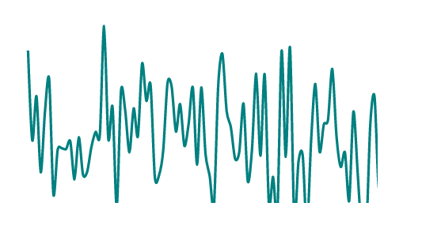

# Day 3

Visualization Type: Line Graph <br>
Data Source: Randomly Generated <br>
Subject: Random Distribution Patterns <br>
Library Used: d3.js <br>



Today I decided to remake and update a project I used for an "opening" visualization for my portfolio website. (<a href="www.michaeldesai.com">michaeldesai.com</a>) This project creates the appearance of a "real-time" line / data stream. I mostly copied it on my last attempt from a block by Mike Bostock but on this go-around, I decided to really spend some time trying to actually make it from scratch. 

I wasn't able to finish this morning within the time limit but this is something I will continue to work on since I do think it has some interesting applications for other visualizations I hope to create. 

What I hope to do to develop this further is to have several lines representing different random data geneation sequences - today's focused on a Normal Distribution with a mean of 40 and a standard deviation of 2. 

I was especially happy with the way the line "draws" itself in at the outset, which was accomplished using some keyframes animation in CSS. I also was happy with how easy it was to use clipPath, even if the difference between the element name "clipPath" and the attribute "clip-path" is maddening - who is responsible for that? In any case, I enjoyed that all you are doing is appending data-driven attributes to a "g" tag with a clip-path attribute. It's sort of a "set it and forget it" style which was easier than expected.

What I struggled with was the update sequence. The ticks right now have a really jarring "bounce" to them, which is at odds with the smooth way that the line draws itself in at the beginning. I need to play around with the changes in the code below to see if I can get it right. My code below is now diverging from Bostock's example, which makes me a bit nervous, but I'd imagine I can get it right if I research a bit. 

```javascript

const pathContainer = bounds.append('g')
    .attr('clip-path', 'url(#clip)')
        .append('path')
            .datum(data)
            .attr('class', 'line')
            .attr('d', series)

tick();

function tick() {
    data.push(random());

    pathContainer
        .attr('d', series)
        .attr('transform', null)
        .transition()
            .duration(1000)
            .ease(d3.easeLinear)
            .attr('transform', 'translate(' + xScale(-1) + ',0)')
            .on('end', tick);

    data.shift();
}

```

