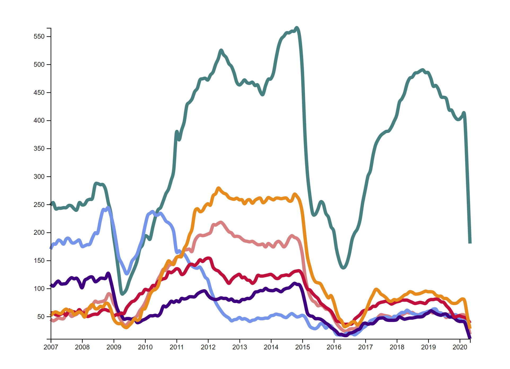

# Day 3

Visualization Type: Line Graph <br>
Data Source: Energy Information Agency (eia.gov) <br>
Subject: Regional Rig Counts for oil and gas drilling <br>
Libraries Used: d3.js, jQuery <br>



Since I love energy so much, I decided to make a chart using the EIA's Drilling Productivity Report, which would be a good way to further develop my line graphing. Why am I sticking with lines? I'm not sure, they are just cool looking to me, especially with the different curves that you can apply to the paths using d3. 

Regardless, I had a few goals for today. The first and most important was to correct my mistake from Day 2 with the Y scale. If there are multiple data series, how can you make sure the domain is corect for scaling? To do this, I wrote my own function, that should be able to use as many data series as possible - I just used Array.shift() to remove the key, put every value for the lines into one, gigantic Array, and then used d3.extent() to find the minimum and maximum values for the scale, and it worked! See below:

```javascript
function findYScale(data) {
    let evaluation = [];

    for (let i = 0; i < data.length; i++) {
        let values = Object.values(data[i]);
        values.shift();

        for (let u = 0; u < values.length; u++) {
           evaluation.push(values[u]);
        }
    }

    result = d3.extent(evaluation);
    return result;
}
```
Unfortunately it is an O^n**2 (I think?) way to solve this problem, since for every loop on the initial 161 values, you have to go through 6 values in the array. So for additional dates and additional series within those dates, the time to complete this operation would increase exponentially. There must be an easier way to do this, but within my time constraint of 2 hours, this was the best I could do. 

Additionally, I'm starting to question the need for Accessor functions since they just add more and more code with the more series that you have. 

Finally, I also accomplished the goal of getting a responsive resize for this graph, which looks great, and it was absurdly easy. The only snag was that until I did d3.selectAll(), I got a duplicate graph below my initial one! I'm not sure why this is. 

```javascript
$(window).on('resize', function() {
    d3.selectAll('svg').remove();
    drawChart();
});

```

To further develop this graph, I'd want to do: 

<ul>
    <li>A legend, obviously</li>
    <li>Annotations on periods of steep decline or rise</li>
    <li>Animations of the paths in as they are loaded</li>
    <li>Showing minimum and maximum values</li>
    <li>Adding a tooltip that would show the date and all the values for each series for that particular date</li>
</ul>