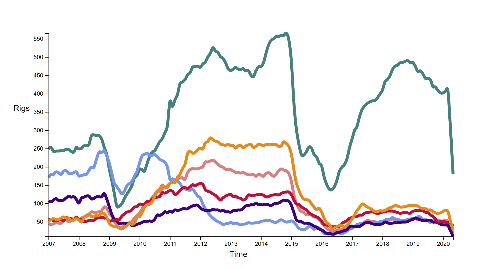

# Day 5

Visualization Type: Line Graph  
Data Source: Energy Information Agency (eia.gov)  
Subject: Regional Rig Counts for oil and gas drilling  
Libraries Used: d3.js, jQuery  
Goal: Create a tooltip that follows along the line and add axis labels 

Slow going today. Tooltips for SVG "path" elements are much more difficult than they appear to be. This is because elements like rectangles and circles have definitive, scaled x and y positions. For a path, the d-attribute that describes the actual line is not as succinct. I stumbled upon a solution that I am adapting for the tooltip. If you overlay a transparent rectangle element on top of the bounds of the graph, and bind event listeners to it on "mouseover", "mousemove", and "mouseleave" - you can use the d3.mouse() methods to retrive the x and y coordinates. Then, by using d3.invert() to invert the x and y positions of those mouse coordinates, you can "reverse" engineer the position of the pixels into where it would be in data. Then, by passing this data to the position of a circle element, you can create a tooltip with the correct position. 

However, I didn't get this far. I created the transparent rect,  bound the event listeners to functions, and was able to use d3.mouse() and d3.invert() to invert the scales, but I began to trip up on the creation of the new circle elements at the right time - the other problem was that I want to create as many circle elements as there are data series, in this case, six. Which complicates things somewhat since I want them all to come into view during a mouseover and mousemove, and then disappear when the user isn't hovering. 

I think I should be able to do this by doing enter(), and merge() but I need to really think about this task in order to solve it. Not as easy as it sounds. 

I also added the axis Labels, a small task that didn't take too long. 

Tomorrow, I am going to add the legend and continue working on the tooltip problem. 
