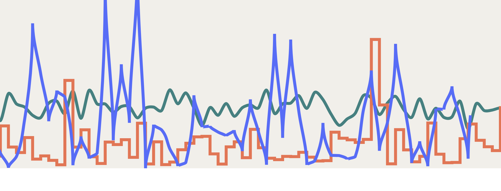

# Day 6

Visualization Type: Line Graph  
Data Source: Randomly Generated  
Subject: Random Distribution Patterns  
Library Used: d3.js  

Today I worked again on the "random" data visualization for my portfolio website. (<a href="www.michaeldesai.com">michaeldesai.com</a>) Since I was frustrated with my tooltip issues yesterday, I decided to focus on creating new random data to be drawn in and had a lot of fun tweaking the random number generations - I used d3.randomNormal, d3.logNormal, and d3.expontential to create the data. I wrote the same function to loop through all elements of each randomly generated array of 90 elements to find the appropriate Y domain, and it  leads to some visually interesting results. I additionally added some different colors and curves to the different paths generated by the elements, which added some additional fun dimensions to this project. 

I did not mess around today with the update function, and decided to save that for later, but the idea will be to have all the lines update themselves, one "tick" at a time and shift slowly the right, just like my original design. Mike Bostock has some interesting Observable Notebooks on creating this effect which I really enjoy, but I don't quite understand yet, so the hope is to replicate the effect with multiple time series. 

Another idea I had was to use a color gradient for each series based on the values, but this takes a back seat to the importance of the update function. 

Really enjoyed doing this work today, as it didn't feel like work at all.

