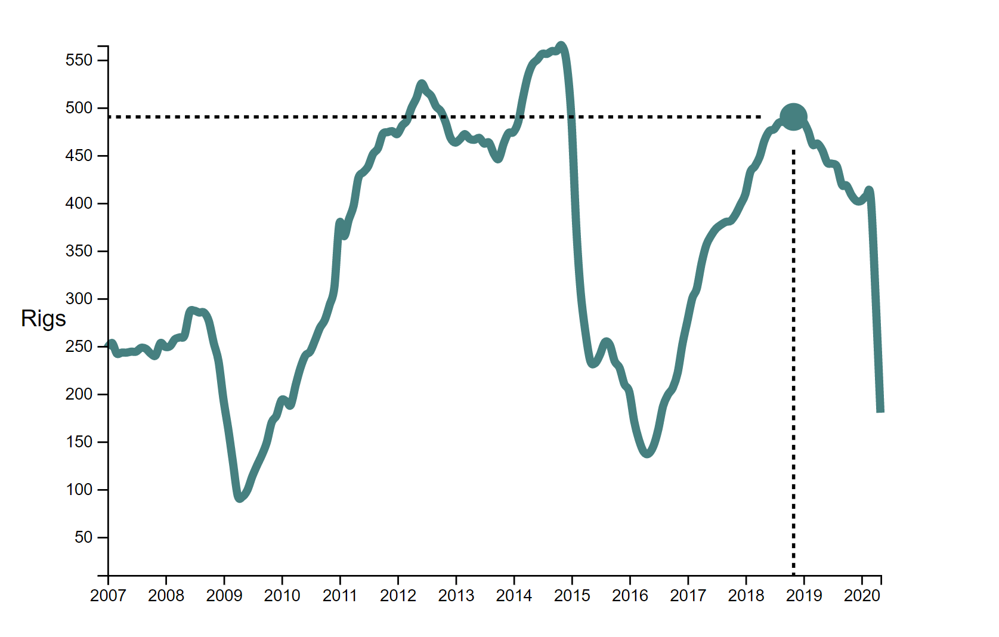

# Day 7

Visualization Type: Line Graph <br>
Data Source: Energy Information Agency (eia.gov) <br>
Subject: Regional Rig Counts for oil and gas drilling <br>
Libraries Used: d3.js, jQuery <br>
Goal: Create a tooltip that follows along the line and add axis labels<br>



Today, I created a circle that follows the x-axis movement of the mouse along the path of the line, and two dotted lines that act as guides to show where exactly the data point is, since there is a lot of it. This was actually quite difficult to do correctly. First, I removed all series except the rig count for the Permian basin, since having multiple data series would have significantly complicated the task here. 

Again, the strategy was to create an "invisible" rect that listens for the movements of the mouse where all the code is bound. I then created the circle and the two lines outside of the function defintions, since I anticipated creating them within the function definitions might create some issues with scope that I wanted to avoid. 

'Mouseover' only changes the opacity of everything to 1, so that they are visible. 'Mouseout' changes them back to 0. I got this functional schema from d3graphgallery's example. 

'Mousemove' is where the magic happens and where I spent the majority of my time trying to get this to work. Ironically, all my issues could be reduced down to 3 lines of code. Using the .invert() method that is part of the scales sublibrary in d3, the appropriate date value was interpolated from the x-axis movement of the mouse, which was captured using d3.mouse(). 

Then, I wrote a function that retrieves an array of elements from my original object dataset, passing it the name of the key I wanted to retrieve, and then mapping each value to the dateParser. This got the date for xLookup and the dates from monthSeries in the same format so that they could actually be compared. 

This insight was critical to being able to use d3.bisect() correctly. What it does is find the closest index in one dataset if given a lookup value, sort of like in Excel if you give a FALSE argument to a VLOOKUP. However, my issue with using this correctly arose from the fact that I needed to parse all the dates correctly so that bisect could compare them correctly. Bisect will only work on a numerical iterable, and obviously it couldn't work for strings. 

This created the necessary variable references needed to pass the circle and line attributes their values for the tooltip focus areas to work properly.

```javascript

        let xLookup = xScale.invert(d3.mouse(this)[0]);
        let monthSeries = retrieveArray(dataset, "month").map(d => dateParser(d));
        let closestX = d3.bisectLeft(monthSeries, xLookup);

```

My hope is that I can further attach an html tooltip with series data to it that will encourage user exploration. 

The next hurdles to clear for this one are: 

<ul>

<li>HTML Div Tooltip with series data in there</li>
<li>Ability to add and subtract data series with checkboxes</li>
<li>Creation of multiple dates if multiple series are drawn</li>
<li>Getting tooltip to update depending on data series checked</li>
<li>Ability to add custom annotations</li>
<li>Brush and zoom to expand the visible data for a particular time period</li>

</ul>