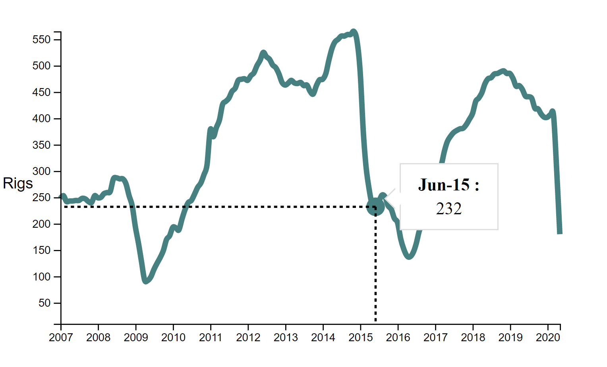

# Day 8

Visualization Type: Line Graph  
Data Source: Energy Information Agency (eia.gov)  
Subject: Regional Rig Counts for oil and gas drilling  
Libraries Used: d3.js, jQuery  
Goal: Create the HTML part of the tooltip for a single series 

Still working on this same line graph, but I think it's ok, because I'm trying to implement interactions that I don't have a lot of experience with. The HTML part of the tooltip required a lot more groundwork to be laid. 

I went with a div-style tooltip rather than a g-style, since I didn't want the display of the data to limited by the size of the SVG. This way the div overlay can extend beyond the right side of the chart, which is important. 

I reused some CSS and the overall schema of the HTML tooltip from Amelia Wattenberger. I especially liked the appearance of an "arrow-like" protrusion from the div that connected to my dot. Most of this work was fairly simple. Using the d3.select() hook and the divs and spans I set up in the HTML, it was easy to use the .text() method to pass data into the DOM. No Vue or React necessary for that!

Apart from that, the update schema is largely the same as the other SVG elements. I tied everything to 'mousemove' so hopefully that is the right thing to do. Luckily, due to my work to create the dots and lines, I already had the coordinates needed to pass them into the transform: translate CSS property that makes the div move. 

For tomorrow, I'm going to need to plan a little bit. 

I want to include many different data series in this same graph... which would be fine if I just wanted to have all of them be included with no more wrinkles. However, what I want is the ability to add and subtract these data series using checkboxes, having the entire graph rescaled, with some nice transitions. 

So I think what this means is that: 

<ul>
        <li>I need some way to check to see if a checkbox is checked or not and a function that returns this from the DOM. </li>
        <li>That array can then be used to create as many paths, dots, and additional HTML tooltips as are checked. </li>
        <li>I will also need an array or object of colors associated with each series.</li>
        <li>The creation and addition of these elements to the DOM can then be tied to a nice looking transition that can hopefully be coded entirely in CSS. </li>
</ul>

 

