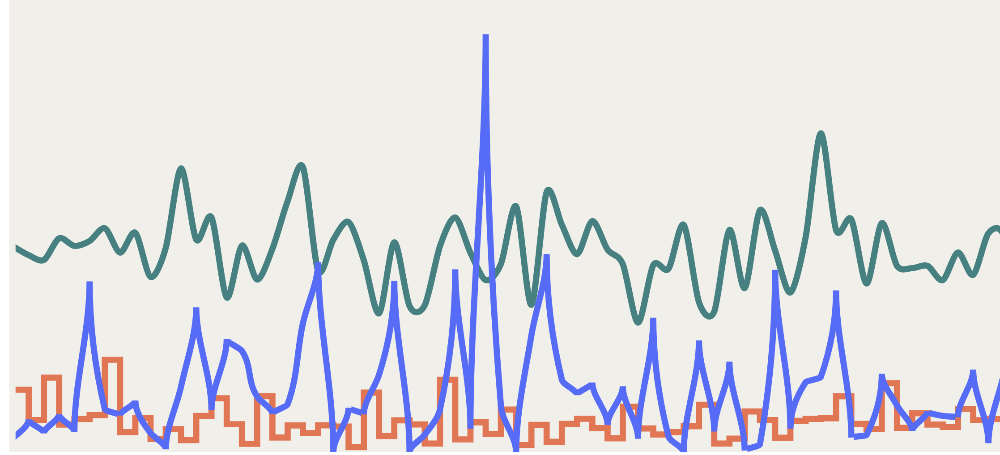

# Day 9

Visualization Type: Line Graph <br>
Data Source: Randomly Generated <br>
Subject: Random Distribution Patterns <br>
Library Used: d3.js <br>



Worked again on my portfolio data art piece that draws different lines of randomness. I'm using <a href=https://bl.ocks.org/mbostock/1642874>this bl.ock</a> of Mike Bostock's for the "tick" function in order to simulate a real-time effect. 

It works, but I had to change many of the selections to make it work. 

For instance, because there are multiple lines, I added a class of "path" to everything and then gave those classes a transition and called the "tick" function on the start of the transition. If I change it to end it does not work. This solution applies the transition to all elements with a class of path. 

```javascript
const transition = d3.transition().duration(500).ease(d3.easeLinear);

d3.selectAll('.path').transition(transition)
        .style('transform', null)
        .on('start', tick);
```

However, while everything works well within function "tick" the transition is still very, very jarring, despite the fact that I've eased the transition linearly. I believe the jarring nature of the transition is due to the .ease(d3.easeLinear) and not being able to change this somehow. I've experiemented with the duration - i.e. making the duration so fast (about 20 milliseconds) that the lines are always moving to the right, but this is not very relaxing to look at and for the first page of my portfolio I don't want people to strain their eyes. 

So I believe the last issue for this viz lies somehow in the way this transition is eased... will have to look into this in the future. 